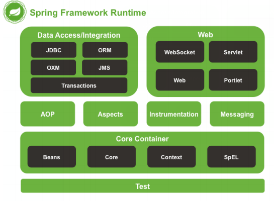

# Spring
## Spring概念
Spring是一个开源框架，为简化企业级开发而生。它以IOC（控制 反转）和AOP（面向切面）为思想内核，提供了控制层SpringMVC、数据层SpringData、服务层
事务管理等众多技术，并可以整合众多第三方框架。
[官网链接，点击跳转](https://spring.io)

## Spring构成

+ Core Container：Spring核心模块，任何功能的使用都离不开该模块，是其他模块建立的基础。
+ Data Access/Integration：该模块提供了数据持久化的相应功能。
+ Web：该模块提供了web开发的相应功能。
+ AOP：提供了面向切面编程实现
+ Aspects：提供与AspectJ框架的集成，该框架是一个面向切面编程框架。
+ Instrumentation：提供了类工具的支持和类加载器的实现，可以在特定的应用服务器中使用。
+ Messaging：为Spring框架集成一些基础的报文传送应用
+ Test：提供与测试框架的集成

## springIOC
在传统开发过程中，对象实例的创建是由调用者管理的，这会产生两个问题：
- 浪费资源：每一次调用方法时即会创建一个对象，如果不断调用方法则会创建大量对象。
- 代码耦合度高：假设随着开发，我们创建了StudentDao另一个更加完善的实现类StudentDaoImpl2，如果在StudentService
中想使用StudentDaoImpl2，则必须修改源码。
