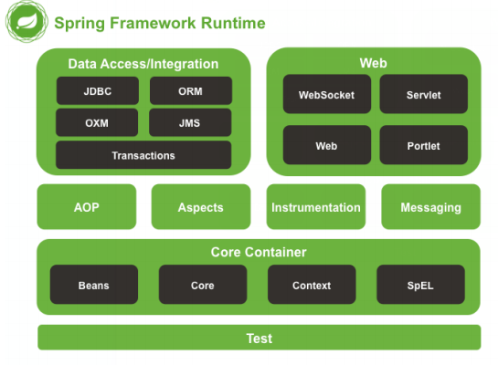

# Spring
## Spring概念
Spring是一个开源框架，为简化企业级开发而生。它以IOC（控制 反转）和AOP（面向切面）为思想内核，提供了控制层SpringMVC、数据层SpringData、服务层
事务管理等众多技术，并可以整合众多第三方框架。
## 官网
[spring官网，点击链接跳转](https://spring.io)

## Spring构成

+ Core Container：Spring核心模块，任何功能的使用都离不开该模块，是其他模块建立的基础。
+ Data Access/Integration：该模块提供了数据持久化的相应功能。
+ Web：该模块提供了web开发的相应功能。
+ AOP：提供了面向切面编程实现
+ Aspects：提供与AspectJ框架的集成，该框架是一个面向切面编程框架。
+ Instrumentation：提供了类工具的支持和类加载器的实现，可以在特定的应用服务器中使用。
+ Messaging：为Spring框架集成一些基础的报文传送应用
+ Test：提供与测试框架的集成

## springIOC
在传统开发过程中，对象实例的创建是由调用者管理的，这会产生两个问题：
- 浪费资源：每一次调用方法时即会创建一个对象，如果不断调用方法则会创建大量对象。
- 代码耦合度高：随着项目的迭代，新增实现类需要对原有代码结构进行大量更改
IOC就是把创建销毁对象的工作从开发者自己转交给了容器，当spring启动时先读取配置文件，创建容器并存储起来。
### 容器接口

BeanFactory：BeanFactory是Spring容器中的顶层接口，它可以对Bean对象进行管理。

ApplicationContext：ApplicationContext是BeanFactory的子接口。它除了继承 BeanFactory的所有功能外，还添加了对国际
化、资源访问、事件传播等方面的良好支持。
ApplicationContext有以下三个常用实现类：
- ClassPathXmlApplicationContext：该类可以从项目中读取配置文件
- FileSystemXmlApplicationContext：该类从磁盘中读取配置文件
- AnnotationConfigApplicationContext：使用该类不读取配置文件，而是会读取注解

### IOC创建对象方式

#### 使用构造方法
Spring默认使用类的空参构造方法创建bean
```xml
<bean id="studentDao" class="com.hp.dao.StudentDaoImpl"/>
        <!--构造方法创建bean对象-->
```
#### 使用工厂类的方法
Spring可以调用工厂类的方法创建bean
```xml
<beans>
    <bean id="studentFactory" class="com.hp.dao.StudentDaoFactory2"/>
    <bean id="studentDao2" factory-bean="studentFactory" factory-method="getStudentDao"/>
    <!--普通工厂创建-->
</beans>
```
#### 使用工厂类的静态方法
Spring可以调用工厂类的静态方法创建bean
```xml
<bean id="studentDao1" class="com.hp.dao.StudentDaoFactory1" factory-method="getStudentDao"/>
    <!--静态工厂创建bean对象-->
```

### 创建对象的策略
Spring通过配置 <bean> 中的 scope 属性设置对象的创建策略，共有五种创建策略
- singleton：单例，默认策略。整个项目只会创建一个对象，通过 <bean> 中的 lazy-init 属性可以设置单例对象的创建时机
- prototype：多例，每次从容器中获取时都会创建对象。
- request：每次请求创建一个对象，只在web环境有效。
- session 每次会话创建一个对象，只在web环境有效。
- gloabal-session 一次集群环境的会话创建一个对象，只在web环境有效。

### 销毁机制
- singleton：对象随着容器的销毁而销毁。
- prototype：使用JAVA垃圾回收机制销毁对象。
- request：当处理请求结束，bean实例将被销毁。
- session：当HTTP Session最终被废弃的时候，bean也会被销毁掉。
- gloabal-session：集群环境下的session销毁，bean实例也将被销毁。

### 生命周期方法
Bean对象的生命周期包含创建——使用——销毁，Spring可以配置
Bean对象在创建和销毁时自动执行的方法
```xml
<!-- init-method:创建对象时执行的方法 
destroy-method:销毁对象时执行的方法 -->
<bean id="studentDao"
      class="com.hp.dao.StudentDaoImpl2"
      scope="singleton"
      init-method="init" 
      destroy-method="destroy">
    
</bean>
```


### 获取bean对象
- 通过id/name获取
```java
public class TestContainer {
    @Test
    public void container1(){
        StudentDao studentDao = (StudentDao)context.getBean("studentDao");
    }
}
```
- 通过类型获取，不需要强制转换

```java
public class TestContainer {
    @Test
    public void container2(){
        StudentDao studentDao = context.getBean(StudentDao.class);
    }
}
```
- 通过类型+id/name获取
```xml
<beans>
    <bean name="studentDao"
          class="com.hp.dao.StudentDaoImpl2">
    </bean>
    <bean name="studentDao1"
          class="com.hp.dao.StudentDaoImpl">
    </bean>
</beans>
```
```java
public class TestContainer {
    @Test
    public void container2(){
        StudentDao studentDao = context.getBean("studentDao",StudentDao.class);
    }
}
```

## DI依赖注入
依赖注入（Dependency Injection，简称DI），它是Spring控制反转思想的具体实现
### 注入方式
#### 构造方法注入
```java
public class StudentServiceImpl2 implements StudentService {
    private StudentDao studentDao;

    /**构造方法注入
     * @param studentDao
     */
    public StudentServiceImpl2(StudentDao studentDao) {
        this.studentDao = studentDao;
    }
}
```
```xml
<bean id="studentService2" class="com.hp.service.impl.StudentServiceImpl2">
        <constructor-arg name="studentDao" ref="studentDao"/>
    </bean>
```
#### setter注入
```java
public class StudentServiceImpl implements StudentService {
    private StudentDao studentDao;

    /**
     * setter注入
     * @param studentDao
     */
    public void setStudentDao(StudentDao studentDao) {
        this.studentDao = studentDao;
    }
    public StudentServiceImpl(StudentDao dao){
        this.studentDao=dao;
    }

}
```
```xml
<bean id="studentService" class="com.hp.service.impl.StudentServiceImpl">
        <property name="studentDao" ref="studentDao"/>
    </bean>
```
#### 自动注入
- 全局配置
  在 <beans> 中设置 default-autowire 属性可以定义所有bean对象的自动注入策略。
- 局部配置
  在 <bean> 中设置 autowire 属性可以定义当前bean对象的自动注入策略。
- autowire的取值如下：

no：不会进行自动注入。

default：全局配置default相当于no，局部配置default表示使用全局配置

byName：在Spring容器中查找id与属性名相同的bean，并进行注入。需要提供set方法。

byType：在Spring容器中查找类型与属性类型相同的bean，并进行注入。需要提供set方法。

constructor：在Spring容器中查找id与属性名相同的bean，并进行注入。需要提供构造方法。
  
### 依赖注入的类型
- Bean
- 基本数据类型
- String
- List
- Set
- Map
- Properties
```java
public class StudentServiceImpl3 implements StudentService {
    private StudentDao studentDao;
    private String name;
    private int count;
    private List<String> names;
    private List<Student> students;
    private Set<Student> studentSet;
    private Map<String,String> stringMap;
    private Map<String,Student> studentMap;
    private Properties properties;

    public StudentDao getStudentDao() {
        return studentDao;
    }

    public void setStudentDao(StudentDao studentDao) {
        this.studentDao = studentDao;
    }

    public String getName() {
        return name;
    }

    public void setName(String name) {
        this.name = name;
    }

    public int getCount() {
        return count;
    }

    public void setCount(int count) {
        this.count = count;
    }

    public List<String> getNames() {
        return names;
    }

    public void setNames(List<String> names) {
        this.names = names;
    }

    public List<Student> getStudents() {
        return students;
    }

    public void setStudents(List<Student> students) {
        this.students = students;
    }

    public Set<Student> getStudentSet() {
        return studentSet;
    }

    public void setStudentSet(Set<Student> studentSet) {
        this.studentSet = studentSet;
    }

    public Map<String, String> getStringMap() {
        return stringMap;
    }

    public void setStringMap(Map<String, String> stringMap) {
        this.stringMap = stringMap;
    }

    public Map<String, Student> getStudentMap() {
        return studentMap;
    }

    public void setStudentMap(Map<String, Student> studentMap) {
        this.studentMap = studentMap;
    }

    public Properties getProperties() {
        return properties;
    }

    public void setProperties(Properties properties) {
        this.properties = properties;
    }

    @Override
    public String toString() {
        return "StudentServiceImpl3{" +
                "studentDao=" + studentDao +
                ", name='" + name + '\'' +
                ", count=" + count +
                ", names=" + names +
                ", students=" + students +
                ", studentSet=" + studentSet +
                ", stringMap=" + stringMap +
                ", studentMap=" + studentMap +
                ", properties=" + properties +
                '}';
    }
}
```
```java
public class Student {
    private int id;
    private String name;
    private String address;

    public Student() {
    }

    public Student(int id, String name, String address) {
        this.id = id;
        this.name = name;
        this.address = address;
    }

    public int getId() {
        return id;
    }

    public void setId(int id) {
        this.id = id;
    }

    public String getName() {
        return name;
    }

    public void setName(String name) {
        this.name = name;
    }

    public String getAddress() {
        return address;
    }

    public void setAddress(String address) {
        this.address = address;
    }

    @Override
    public String toString() {
        return "Student{" +
                "id=" + id +
                ", name='" + name + '\'' +
                ", address='" + address + '\'' +
                '}';
    }
}
```
```xml
<beans>
  <bean id="student1" class="com.hp.domain.Student">
    <property name="name" value="张三"/>
    <property name="address" value="山西"/>
    <property name="id" value="1"/>
  </bean>
  <bean id="studentService3" class="com.hp.service.impl.StudentServiceImpl3">
    <property name="studentDao" ref="studentDao"/>
<!--    注入bean-->
    <property name="count" value="1"/>
<!--    注入基本类型-->
    <property name="name" value="张三"/>
<!--    注入String-->
    <property name="names">
      <list>
        <value>北京</value>
        <value>上海</value>
        <value>广州</value>
      </list>
    </property>
<!--    注入list-->
    <property name="students">
      <list>
        <bean class="com.hp.domain.Student">
          <property name="name" value="张三"/>
          <property name="address" value="山西"/>
          <property name="id" value="1"/>
        </bean>
        <bean class="com.hp.domain.Student">
          <property name="name" value="李四"/>
          <property name="address" value="山东"/>
          <property name="id" value="2"/>
        </bean>
      </list>
    </property>
<!--    注入List<Student>-->
    <property name="studentSet">
      <set>
        <bean class="com.hp.domain.Student">
          <property name="name" value="张三"/>
          <property name="address" value="山西"/>
          <property name="id" value="1"/>
        </bean>
        <bean class="com.hp.domain.Student">
          <property name="name" value="李四"/>
          <property name="address" value="山东"/>
          <property name="id" value="2"/>
        </bean>
      </set>
    </property>
<!--    注入Set<Student>-->
    <property name="stringMap">
      <map>
        <entry key="s1" value="zzz"/>
        <entry key="s2" value="ssss"/>
      </map>
    </property>
    <!--注入Map<String,String>-->
    <property name="studentMap">
      <map>
        <entry key="aaa" value-ref="student1"/>
        <entry key="bbb" value-ref="student1"/>
      </map>
    </property>
    <!--注入Map<String,Student>-->
    <property name="properties">
      <props>
        <prop key="config1">111111</prop>
        <prop key="config2">222222</prop>
      </props>
    </property>
<!--    注入Properties-->
  </bean>
</beans>
```
## 注解实现IOC
不再详细介绍，可以看源码。
注解真的是yyds
### @Component
@Component 注解中的value属性值表示bean对象的id
### @Repository、@Service、@Controller
### @Scope
### @Autowired
### @Qualifier
### @Value
### @Configuration
### @ComponentScan
### @PropertySource
### @Bean
###@Import

## spring整合mybatis

## SpringAOP
AOP的全称是Aspect Oriented Programming，即面向切面编程。
是实现功能统一维护的一种技术，它将业务逻辑的各个部分进行隔
离，使开发人员在编写业务逻辑时可以专心于核心业务，从而提高
了开发效率。
- 作用：在不修改源码的基础上，对已有方法进行增强。
- 实现原理：动态代理技术。
- 优势：减少重复代码、提高开发效率、维护方便
- 应用场景：事务处理、日志管理、权限控制、异常处理等方面。
### AOP相关术语
|名称 |说明|
|---|---|
|JoinPoint（连接点）| 指能被拦截到的点，在Spring中只有方法能被拦截。|
|Pointcut（切点）| 指要对哪些连接点进行拦截，即被增强的方法。|
|Advice（通知）| 指拦截后要做的事情，即切点被拦截后执行的方法。|
|Aspect（切面）| 切点+通知称为切面|
|Target（目标）| 被代理的对象|
|Proxy（代理）| 代理对象|
|Weaving（织入）| 生成代理对象的过程|
### AOP通知类型
AOP有以下几种常用的通知类型

|通知类型|描述|
|:---:|:---|
| 前置通知 | 在方法执行前添加功能         |
| 后置通知 | 在方法正常执行后添加功能       |
| 异常通知 | 在方法抛出异常后添加功能       |
| 最终通知 | 无论方法是否抛出异常，都会执行该通知 |
| 环绕通知 | 在方法执行前后添加功能        |
### AOP切点表达式

### 注解配置AOP
#### @Aspect
### SpringAOP_原生Spring实现AOP

## Sprig事务
