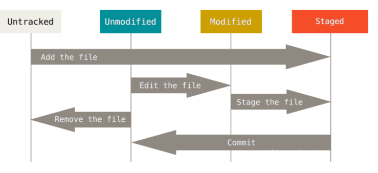
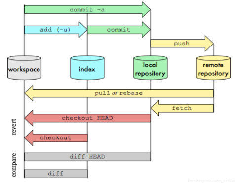

# GIT
选自CSDN文章，仅用于个人学习使用
[原文链接地址](https://blog.csdn.net/qq_42363495/article/details/104878170)
## 官网
[点击链接跳转](https://git-scm.com/)
## 常用linux命令
|linux命令|含义|
|:---:|:---:|
|cd|切换目录|
|pwd|显示当前目录|
|ls(ll)|列出当前目录文件|
|touch|新建文件|
|rm|删除文件(rm -rf强制删除所有文件！！！慎用)|
|mv|移动文件|
|reset|初始化终端/清屏|
|clear|清屏|
|cat|显示文件内容|
|help|帮助|
|#|注释|

## git配置
git config -h 查看配置帮助
- git config -l 查看当前git环境详细配置
- git config --system --list查看系统config配置文件在git安装目录/etc/gitconfig
- git config --global --list查看当前用户配置
- git config --local --list查看当前仓库配置信息 
- 修改git配置 git config [--local][--global][--system] section.key value
## git文件的四种状态

- Untracked: 未跟踪, 此文件在文件夹中, 但并没有加入到git库, 不参与版本控制. 通过git add 状态变为Staged.
- Unmodify: 文件已经入库, 未修改, 即版本库中的文件快照内容与文件夹中完全一致. 这种类型的文件有两种去处, 如果它被修改, 而变为Modified. 如果使用git rm移出版本库, 则成为Untracked文件
- Modified: 文件已修改, 仅仅是修改, 并没有进行其他的操作. 这个文件也有两个去处, 通过git add可进入暂存staged状态, 使用git checkout 则丢弃修改过, 返回到unmodify状态, 这个git checkout即从库中取出文件, 覆盖当前修改
- Staged: 暂存状态. 执行git commit则将修改同步到库中, 这时库中的文件和本地文件又变为一致, 文件为Unmodify状态. 执行git reset HEAD filename取消暂存, 文件状态为Modified
## git常用命令

### init && clone
- git init 在当前目录新建一个仓库
- git init [project-name] 在一个目录下新建本地仓库
- git clone [url] 克隆一个远程仓库

### diff
- git diff HEAD -- . 查看最新本地版本库和工作区所有文件的区别
- git diff HEAD -- [file-name] 查看最新本地版本库和工作区文件的却别
- git diff HEAD^ -- [file-name] 查看本地上一个版本和工作区文件的却别
- git diff [local branch] origin/[remote branch] 比较本地分支和远程分支的区别

### status
- git status [file-name] 查看指定文件状态
- git status 查看所有文件状态

### add
- git add [file-name1] [file-name2] ... 从工作区添加指定文件到暂存区
- git add . 将工作区的被修改的文件和新增的文件提交到暂存区，不包括被删除的文件
- git add -u . u指update，将工作区的被修改的文件和被删除的文件提交到暂存区，不包括新增的文件
- git add -A . A指all，将工作区被修改、被删除、新增的文件都提交到暂存区

### commit
- git commit -m [massage] 将暂存区所有文件添加到本地仓库
- git commit [file-name-1] [file-name-2] -m [massage] 将暂存区指定文件添加到本地仓库
- git commit -am [massage] 将工作区的内容直接加入本地仓库
- git commit --amend 快速将当前文件修改合并到最新的commit，不会产生新的commit。在提交commit后发现还有部分文件修改忘记提交了可以是用该命令
加-m是指直接在后面写上版本的注释，不加-m的话会用一个vim打开文件让你写入massage，有未追踪的文件将会失败，需要add加入暂存区。

### clean
- git clean -df 加-d是指包含目录，加-f是指强制，删除所有未跟踪的文件

### log
- git log 显示所有commit日志
- git log --pretty=oneline 将日志缩写为单行显示
- git log --graph --pretty=oneline --abbrev-commit 查看分支合并情况
- git log --oneline --decorate --graph --all 查看分叉历史，包括：提交历史、各个分支的指向以及项目的分支分叉情况。
- git log -3 查看最新3条commit日志数据

### reflog
- git reflog 显示操作本地版本库的命令，包括commit和reset等，在回退版本以后又后悔找不到commit id了可以使用此命令查看历史

### push
- git push 将文件添加到远程仓库
- git push -f 强制提交，当我们本地reset到旧的版本时，然后普通push会被拦截，因为此是本地HEAD指向比远程库还要旧
- git push origin [branch-name] 推送当前本地分支到指定远程分支

### rm
- git rm --cached [file-name] 删除暂存区的文件

- git rm -rf . 不但删除所有暂存区的文件，还删除所有工作区的物理文件

### checkout
- git checkout -- [file-name]
最好加--，没有的话就把它当作切换分支看待，切换到另一个分支了，如果没有这个分支也会把它当作文件执行。
用暂存区的文件覆盖掉工作区的文件。如果暂存区没有可更新的就会用commit的文件更新工作区的文件
- git checkout [branch] 切换分支
- git checkout -b [new-branch-name] 创建并切换分支

### reset
当对整个版本进行操作
- git reset --{soft|(mixed)|hard} HEAD 
--soft 其中可选参数soft表示单纯的切换HEAD指向的commit-id

--mixed 默认值mixed参数表示先执行上面一步，然后再将commit-id里面的内容更新到暂存区

--hard hard表示先执行上面两步，然后再将暂存区内容同步到工作区

- git reset --hard HEAD^^ 用上两个版本里的所有文件撤回到暂工作区
- git reset --hard [commit id] 用指定版本的所有文件撤回到工作区当对当个文件进行操作
- git reset HEAD [file-name]
对单个文件操作时候只能用mixed参数，而且还是可省略
对单个文件操作时候HEAD指向不会变
将commit中指定的文件同步到暂存区中
- git reset [commit-id] [file-name] 将指定commit-id中的文件替换掉暂存区的文件


### branch
- git branch [branch-name] 创建分支
- git branch 查看当前分支
- git branch -a 查看本地和远程的所有分支
- git branch -r 查看远程所有分支
- git branch -d [branch-name] 删除一个分支
- git branch -D [branch-name] 强制删除一个没有合并的分支
- git branch --set-upstream-to=origin/[branch-name] [branch-name] 把本地分支和远程分支进行连接

### merge
- git merge 合并本地origin/[branch-name]和HEAD->[branch-name]的代码，并同步到工作空间
- git merge [branch-name] 用于合并指定分支到当前分支
- git merge --quit 退出当前分支合并，当合并后冲突很多，要撤回合并分支就可以用这个命令
- git merge --no-ff -m [massage] [branch-name] 不使用Fast forward合并分支，这样会创建新的commit，所以需要massage。这样被合并的分支HEAD指向是会变的。
如果使用了Fast forward方式合并分支，那么删除次要分支的时候历史分支记录也会被删除，这样就无法追寻分支合拼信息了。

### switch
- git switch -c [branch-name] 创建新分支并切换到该分支
- git switch [branch-name] 切换到已有分支

### remote
- git remote add origin 远程地址 关联远程仓库
- git remote 查看本地添加了哪些远程分支地址
- git remote -v 查看本地添加了哪些远程分支地址更详细信息
- git remote remove origin 删除本地指定的远程地址

### fetch
- git fetch 拉取远程分支最新的commit到本地仓库的origin/[branch-name]

### pull
- git pull 从远程仓库拉取代码到工作空间
- pull 和 fetch的关系
git pull == git fetch + git merge


### tag
- git tag 查看所有标签
- git tag [version] 给当前最新的commit打上标签
- git tag [version] [commit-id] 给指定的commit-id打上标签
- git tag -a [version] -m [massage] [commit-id] 给指定的commit-id打上标签并附上说明文字
- git tag -d [version] 删除标签


### submodule
```bash
#添加submodule
git submodule add <submodule_url>
```
```bash
# 删除submodule
git submodule deinit project-sub-1
git rm project-sub-1
```

